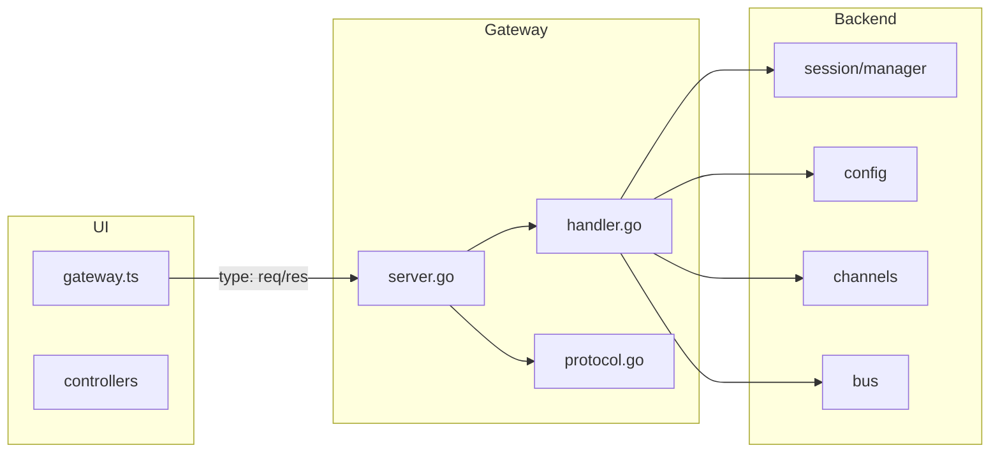

# 前端对应接口与功能实现计划

## 一、现状与差距概览

前端 [ui/src/ui/gateway.ts](goclaw/ui/src/ui/gateway.ts) 通过 WebSocket 发送 **自定义帧**（非标准 JSON-RPC 2.0）：

- **请求**：`{ type: "req", id, method, params }`
- **期望响应**：`{ type: "res", id, ok, payload? }` 或错误时 `error: { code, message, details? }`
- **握手**：连接后先发 `connect`，期望收到 **hello-ok**（protocol、features、snapshot 等）

当前后端 [gateway/protocol.go](goclaw/gateway/protocol.go) / [gateway/server.go](goclaw/gateway/server.go)：

- **解析**：按 `jsonrpc/id/method/params` 解析，且强制 `jsonrpc == "2.0"`，导致前端发来的 `type: "req"` 无法通过（缺少 jsonrpc 或版本被拒）
- **响应**：返回 `{ jsonrpc, id, result }` 或 `error`，前端期望的是 `type/res/ok/payload`，无法正确解析
- **无 connect**：未实现 `connect` 方法，前端握手会报 method not found

因此需要：**协议适配** + **实现 connect** + **补全前端调用的所有 method**。

---

## 二、前端调用的方法清单与后端状态

| 前端 method                                                       | 后端状态          | 说明                                                                                   |
| --------------------------------------------------------------- | ------------- | ------------------------------------------------------------------------------------ |
| **connect**                                                     | 未实现           | 握手，需返回 hello-ok（protocol、features、snapshot 等）                                        |
| **config.get**                                                  | 已实现           | 需补充 hash、config、valid、issues 等以符合 ConfigSnapshot                                     |
| **config.set**                                                  | 已实现           | 需接受 baseHash（可选）                                                                     |
| **config.schema**                                               | 未实现           | 返回 JSON Schema + uiHints + version                                                   |
| **config.apply**                                                | 未实现           | 应用配置并可选重载                                                                            |
| **update.run**                                                  | 未实现           | 执行更新/重载（可先空实现或与 config 重载合并）                                                         |
| **health**                                                      | 已实现           | 正常                                                                                   |
| **status**                                                      | 未实现           | Debug 用，可返回与 health 类似或更详细                                                           |
| **last-heartbeat**                                              | 未实现           | 可返回最后心跳时间                                                                            |
| **models.list**                                                 | 未实现           | 返回可用模型列表（可从 providers 配置推导）                                                          |
| **sessions.list**                                               | 已实现           | 返回结构需改为 SessionsListResult（ts, path, count, defaults, sessions: GatewaySessionRow[]） |
| **sessions.patch**                                              | 未实现           | 按 key 更新 label/thinkingLevel/verboseLevel/reasoningLevel                             |
| **sessions.delete**                                             | 未实现           | 按 key 删除会话并可删 transcript                                                             |
| **sessions.usage**                                              | 未实现           | Usage 页                                                                              |
| **sessions.usage.timeseries**                                   | 未实现           | 按 session key 的时序                                                                    |
| **sessions.usage.logs**                                         | 未实现           | 按 session key 的日志                                                                    |
| **usage.cost**                                                  | 未实现           | 成本汇总                                                                                 |
| **chat.send**                                                   | 已实现但委托 send   | 需按 sessionKey/message/deliver/idempotencyKey/attachments 处理，并走会话+总线                  |
| **chat.history**                                                | 已实现           | 前端还期望 thinkingLevel，可补充                                                              |
| **chat.abort**                                                  | 已实现           | 正常                                                                                   |
| **channels.status**                                             | 已实现但需 channel | 前端传 probe/timeoutMs，期望 ChannelsStatusSnapshot；需支持无 channel 时返回全量 snapshot            |
| **channels.logout**                                             | 未实现           | 如 channel=whatsapp 登出                                                                |
| **web.login.start** / **web.login.wait**                        | 未实现           | WhatsApp 扫码登录（可选或占位）                                                                 |
| **agents.list**                                                 | 已实现           | 返回结构需对齐 AgentsListResult（defaultId, mainKey, scope, agents）                          |
| **agent.identity.get**                                          | 未实现           | 按 agentId 返回名称/头像等                                                                   |
| **skills.status**                                               | 未实现           | 全量或按 agentId 的技能状态                                                                   |
| **skills.update**                                               | 未实现           | 按 skillKey 更新 enabled 或 apiKey                                                       |
| **agents.files.list** / **get** / **set**                       | 未实现           | Agent 工作区文件列表/读/写                                                                    |
| **logs.tail**                                                   | 未实现           | 前端用 logs.tail（cursor, limit, maxBytes）；后端仅有 logs.get，需新增或别名并统一参数                     |
| **logs.get**                                                    | 已实现           | 可保留，与 logs.tail 统一为同一实现或别名                                                           |
| **cron.status**                                                 | 未实现           | 返回定时任务列表与状态                                                                          |
| **cron.add** / **cron.update** / **cron.run** / **cron.remove** | 未实现           | 定时任务 CRUD 与立即执行                                                                      |
| **system-presence**                                             | 未实现           | 返回 PresenceEntry 列表（网关/节点在线信息）                                                       |
| **device.pair.approve** / **reject** / **device.token.revoke**  | 未实现           | 设备配对与 token 撤销（可与 connect 设备认证配合，先占位）                                                |
| **exec.approvals.get** / **exec.approvals.set**                 | 未实现           | 执行审批配置（gateway 端）                                                                    |
| **exec.approvals.node.get** / **exec.approvals.node.set**       | 未实现           | 节点端执行审批配置                                                                            |
| **exec.approval.resolve**                                       | 未实现           | 审批决议（allow-once / allow-always / deny）                                               |

---

## 三、实现步骤

### 1. WebSocket 协议适配（必须优先）

- **请求解析**  
  - 在 [gateway/server.go](goclaw/gateway/server.go) 的 `handleWebSocketMessages` 中，解析 JSON 后识别两种格式：  
    - 前端格式：`type == "req"` 且存在 `id`, `method`, `params`；  
    - 现有格式：`jsonrpc == "2.0"` 且存在 `method`。
  - 统一转换为内部 `JSONRPCRequest`（或新增 GatewayRequest 结构），包含 `ID`、`Method`、`Params`。  
  - 对 `connect` 方法不做 jsonrpc 版本校验，其余方法可保留或放宽校验。
- **响应编码**  
  - 在 [gateway/protocol.go](goclaw/gateway/protocol.go) 或 server 中：若请求来自前端格式（或统一改为前端格式），则响应使用：  
    - 成功：`{ type: "res", id, ok: true, payload }`  
    - 失败：`{ type: "res", id, ok: false, error: { code, message, details? } }`
  - 保持与 [ui/src/ui/gateway.ts](goclaw/ui/src/ui/gateway.ts) 中 `GatewayResponseFrame` 的解析一致（resolve(res.payload)）。
- **连接建立**  
  - 可选：服务端在升级完成后不再发送当前的 `connected` 通知，改为等客户端发 `connect` 后再回复；或保留当前欢迎消息，但确保首条业务请求 `connect` 能正确解析并回复。

### 2. 实现 connect 握手

- 在 [gateway/handler.go](goclaw/gateway/handler.go) 的 `registerSystemMethods`（或新建 `registerConnect`）中注册 **connect**。  
- 参数：接受前端传来的 `minProtocol/maxProtocol`、`client`、`role`、`scopes`、`device`、`auth` 等（可先做最小解析，不强制校验）。  
- 返回 **hello-ok** 结构（与 [ui/src/ui/gateway.ts](goclaw/ui/src/ui/gateway.ts) 中 `GatewayHelloOk` 一致），例如：  
  - `type: "hello-ok"`（若前端期望在 payload 里）或直接 payload 为 `{ protocol: 3, features: { methods: [...], events: [...] }, snapshot?: { sessionDefaults?, ... } }`
- 若前端在 connect 后根据 `hello.features.methods` 做能力检测，则在 `features.methods` 中列出已实现的 method 名。  
- 设备认证（device/auth）：若当前 goclaw 不做设备绑定，可先返回固定 role/scopes，不签发 deviceToken；后续再接真实认证。

### 3. 已存在方法的增强

- **config.get**  
  - 在 [gateway/handler.go](goclaw/gateway/handler.go) 的 config.get 中：  
    - 增加对配置的 hash（如 SHA256 或简单哈希），写入返回的 `hash`。  
    - 若前端需要 `config`（解析后的对象）、`valid`、`issues`，则在服务端做一次 Validate 后返回 parsed、valid、issues（参考 [ui/src/ui/types.ts](goclaw/ui/src/ui/types.ts) 中 `ConfigSnapshot`）。
- **config.set**  
  - 接受 `baseHash`（可选），若提供则与当前配置 hash 比较，不一致则返回冲突错误，避免覆盖。
- **sessions.list**  
  - 返回结构改为 [ui/src/ui/types.ts](goclaw/ui/src/ui/types.ts) 的 `SessionsListResult`：  
    - `ts`（当前时间戳）、`path`（会话存储路径）、`count`、`defaults`（如 model、contextTokens）、`sessions`：数组元素为 `GatewaySessionRow`（key、kind、label、displayName、updatedAt、thinkingLevel、verboseLevel 等）。
  - 从 [session/manager.go](goclaw/session/manager.go) 与现有会话元数据中凑齐这些字段；若缺少 kind/label/displayName，可先按 key 推导或留空。
- **chat.send**  
  - 不再简单委托到 `send`（channel/chat_id/content）。  
  - 按 `sessionKey`、`message`、`deliver`、`idempotencyKey`、`attachments` 处理：  
    - 根据 sessionKey 获取或创建会话，构造 user 消息（含附件），写入会话历史。  
    - 通过 [bus](goclaw/bus) 发布 Inbound 到网关会话对应的 agent（若存在 channel/chat_id 映射则用现有 send 逻辑）。
  - 这样前端聊天页的发送与历史能一致。
- **channels.status**  
  - 当前 [gateway/handler.go](goclaw/gateway/handler.go) 要求 `channel` 必填；前端传的是 `probe`、`timeoutMs`，且期望 [ChannelsStatusSnapshot](goclaw/ui/src/ui/types.ts)。  
  - 改为：若未传 `channel` 或 channel 为空，则遍历 [channels/manager.go](goclaw/channels/manager.go) 的 List()，对每个 channel 调 Status()，组装成 `ts`、`channelOrder`、`channels`、`channelAccounts`、`channelDefaultAccountId` 等；若传了 channel，则保持单 channel 查询并包装成同一 snapshot 结构。
- **agents.list**  
  - 返回结构与 [AgentsListResult](goclaw/ui/src/ui/types.ts) 对齐：`defaultId`、`mainKey`、`scope`、`agents`（id、name、identity 等）；从现有 ~/.goclaw/agents 与配置中填充。

### 4. 新增必须的 RPC 方法（按前端页面分组）

- **配置与更新**  
  - **config.schema**：从 [config/schema.go](goclaw/config/schema.go) 或手写/生成 JSON Schema，加上 uiHints、version、generatedAt。  
  - **config.apply**：写回配置并触发重载（调用 config.Load 等），可选 sessionKey 用于提示。  
  - **update.run**：可暂时实现为与 config 重载相同或空实现返回 ok。
- **会话与 Usage**  
  - **sessions.patch**：根据 key 更新会话元数据（label、thinkingLevel、verboseLevel、reasoningLevel）；若 session 层暂无这些字段，需在 [session](goclaw/session) 的 Metadata 或扩展结构中支持。  
  - **sessions.delete**：按 key 删除会话并从存储中移除；deleteTranscript 为 true 时删除历史。  
  - **sessions.usage**、**sessions.usage.timeseries**、**sessions.usage.logs**、**usage.cost**：若当前无使用量统计，可先返回空结构（如空数组、0 成本），保证前端不报错；后续再接真实统计。
- **日志**  
  - **logs.tail**：与现有 logs.get 统一：支持 `cursor`、`limit`、`maxBytes`，返回 `file`、`cursor`、`lines`、`truncated`、`reset` 等，与 [ui/src/ui/controllers/logs.ts](goclaw/ui/src/ui/controllers/logs.ts) 的入参和解析一致；可将 logs.get 改为内部实现，对外同时注册 logs.get 与 logs.tail。
- **Debug**  
  - **status**：返回与 health 类似或更详细（版本、运行时间等）。  
  - **last-heartbeat**：返回连接最后活跃时间或固定值。  
  - **models.list**：从 config providers 与 agents 配置收集 model 列表返回。
- **Agent 与技能**  
  - **agent.identity.get**：根据 agentId 从 agents 配置或 ~/.goclaw/agents 读取 name/avatar/emoji 等，返回 [AgentIdentityResult](goclaw/ui/src/ui/types.ts)。  
  - **skills.status**：从 [internal/builtin_skills.go](goclaw/internal/builtin_skills.go) 或技能注册表返回技能列表及 enabled 等；支持可选 `agentId`。  
  - **skills.update**：按 skillKey 更新 enabled 或 apiKey（若配置或注册表支持）。  
  - **agents.files.list** / **agents.files.get** / **agents.files.set**：对应 agent 工作区目录下列表、读文件、写文件；路径需限制在工作区内，防止越权。
- **通道**  
  - **channels.logout**：根据 channel 调用对应通道的登出（如 WhatsApp）；若某通道未实现，可返回“不支持”或 no-op。  
  - **web.login.start** / **web.login.wait**：WhatsApp 扫码登录；若当前通道实现没有，可先返回“未实现”或占位。
- **Cron**  
  - **cron.status**：若项目已有 cron 模块则返回任务列表与状态；否则返回空数组。  
  - **cron.add** / **cron.update** / **cron.run** / **cron.remove**：有则实现，无则占位返回“未实现”。
- **Presence 与设备**  
  - **system-presence**：返回当前网关连接列表或静态列表（如当前连接 ID、角色），格式为 [PresenceEntry](goclaw/ui/src/ui/types.ts) 数组。  
  - **device.pair.approve** / **device.pair.reject** / **device.token.revoke**：可与 connect 的设备认证一起做占位（返回 ok 或“未实现”）。
- **Exec 审批**  
  - **exec.approvals.get** / **exec.approvals.set**：读写网关侧执行审批配置（如 [approvals 配置](goclaw/config/schema.go) 或独立文件）。  
  - **exec.approvals.node.get** / **exec.approvals.node.set**：若存在节点概念则读写节点侧配置，否则占位。  
  - **exec.approval.resolve**：根据 id 与 decision 更新待审批状态并通知（若暂无队列可先只返回 ok）。

### 5. 事件推送（可选）

- 前端若通过 `onEvent` 监听如 `chat.run.delta`、`chat.run.final`、`presence`、`health` 等，需在 [gateway/server.go](goclaw/gateway/server.go) 的广播或 handler 中，在适当时机向连接推送 `{ type: "event", event, payload, seq?, stateVersion? }`。  
- 可与现有 `broadcastOutbound` 结合，或单独维护 event 序列号与 stateVersion；若当前前端能在无事件下正常工作，可放到后续迭代。

### 6. 测试与验证

- 在 gateway 层为 **connect**、**config.get/set**、**sessions.list**、**chat.send**、**channels.status** 等加单元测试或集成测试（发 type: "req" 帧并断言 type: "res" 与 payload）。  
- 用浏览器打开 Control UI，依次验证：连接与 hello-ok、概览、会话列表、单会话聊天、配置读写、Agent 列表、通道状态、技能、日志、Debug、Exec 审批等，确认无 “method not found” 与解析错误。

---

## 四、依赖与文件关系

- **协议**：仅 gateway 包解析/编码与 handler 注册；session、config、channels、bus 保持现有接口，由 handler 调用并组装前端所需结构。

---

## 五、建议实现顺序

1. **协议适配**（请求 type/id/method/params，响应 type/res/ok/payload） + **connect** 与 **hello-ok** → 确保前端能连上并拿到 features。
2. **config.get/set 增强** + **config.schema** + **config.apply** + **update.run** → 配置页可用。
3. **sessions.list 结构调整** + **sessions.patch** + **sessions.delete** + **chat.send** 按 sessionKey 重写 → 会话与聊天页可用。
4. **channels.status** 全量 snapshot + **agents.list** 结构对齐 + **agent.identity.get** → 概览与 Agent 页基本可用。
5. **logs.tail**、**status**、**models.list**、**last-heartbeat** → Debug 可用。
6. **skills.status** / **skills.update**、**agents.files.***、**cron.***、**system-presence**、**device.***、**exec.approvals.***、**exec.approval.resolve**、**sessions.usage** / **usage.cost**、**channels.logout**、**web.login.*** → 其余 tab 可占位或逐步实现。

按上述顺序可实现“前端功能对应的接口与功能”，并优先保证连接、配置、会话与聊天、概览、Debug 可用，其余再按需补全或占位。